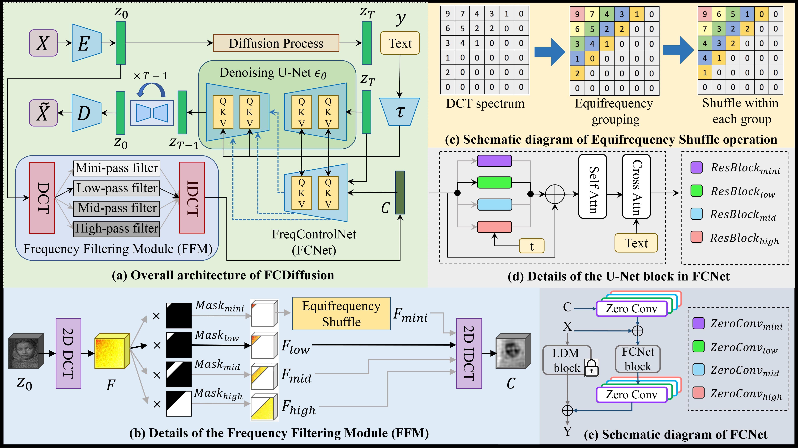
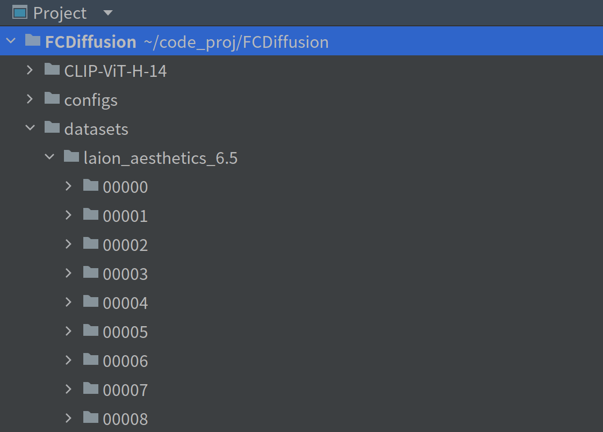

# Frequency-Controlled-Diffusion-Model

# Introduction
**This project tackles the problem of text-guided image-to-image translation (I2I), i.e., translating a source image with a natural-language text prompt.** We harness the immense generative power of the pre-trained large-scale text-to-image diffusion model and extend it from text-to-image generation to text-guided I2I, providing intelligent tools for image manipulation tasks.  

Observing that I2I has diverse application scenarios emphasizing different correlations (e.g., style, structure, layout, contour, etc.) between the source and translated images, it is difficult for a single existing method to suit all scenarios well. This inspires us to design a unified framework enabling flexible control over diverse I2I correlations and thus applies to diverse I2I application scenarios.  

We propose to realize versatile text-guided I2I from a novel frequency-domain perspective: model the I2I correlation of different I2I tasks with the corresponding frequency band of image features in the frequency domain. Specifically, we filter image features in the Discrete Cosine Transform (DCT) spectrum space and extract the filtered image features carrying a specific DCT frequency band as control signal to control the corresponding I2I correlation. **Accordingly, we realize I2I applications of style-guided content creation, image semantic manipulation, image scene translation, and image style translation under the mini-frequency-band control, low-frequency-band control, mid-frequency-band control, and high-frequency-band control respectively.**  

Below is the overall model architecture, please refer to the paper (coming soon) for more technical details.

                

                      
                

            
Figure 1. The overall architecture of FCDiffusion, as well as details of important modules and operations. FCDiffusion comprises the pretrained LDM, a Frequency Filtering Module (FFM), and a FreqControlNet (FCNet). The FFM applies DCT filtering to the source image features, extracting the filtered image features carrying a specific DCT frequency band as control signal, which controls the denoising process of LDM through the FCNet. FCDiffusion integrates multiple control branches with different DCT filters in the FFM, these DCT filters extract different DCT frequency bands to control different I2I correlations (e.g., image style, structure, layout, contour, etc.).
	    

	    

# Environment
First, create a new conda virtual environment:  
<pre><code>
conda create -n env_name python=3.8
</code></pre>
Then, install pytorch related packages using conda:  
<pre><code>
conda install pytorch==1.12.1 torchvision==0.13.1 torchaudio==0.12.1 cudatoolkit=11.6 -c pytorch -c conda-forge
</code></pre>
Last, install the required packages in the requirements.txt:  
<pre><code>
pip install -r requirements.txt
</code></pre>

# Dataset
Since we do not train the large-scale latent diffusion model (LDM) from scratch but rather train a frequency-based control network of the pre-trained LDM, a small subset of LAION 5B is sufficient for our task. Therefore, we use **LAION Aesthetics 6.5+** which comprises 625K image-text pairs as the training set of our model. Download and put it in the **datasets** folder of the project as shown below:

                

                      
		

	    

