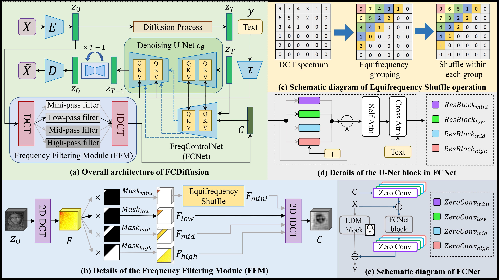
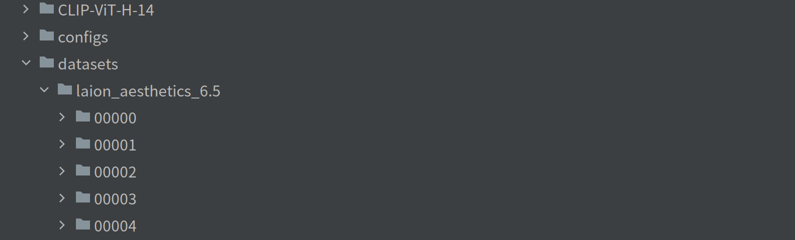
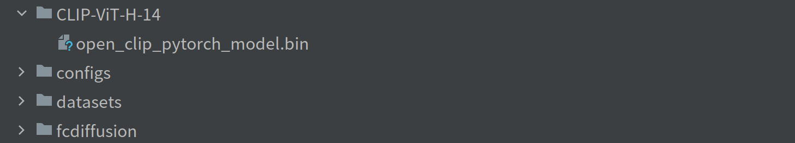
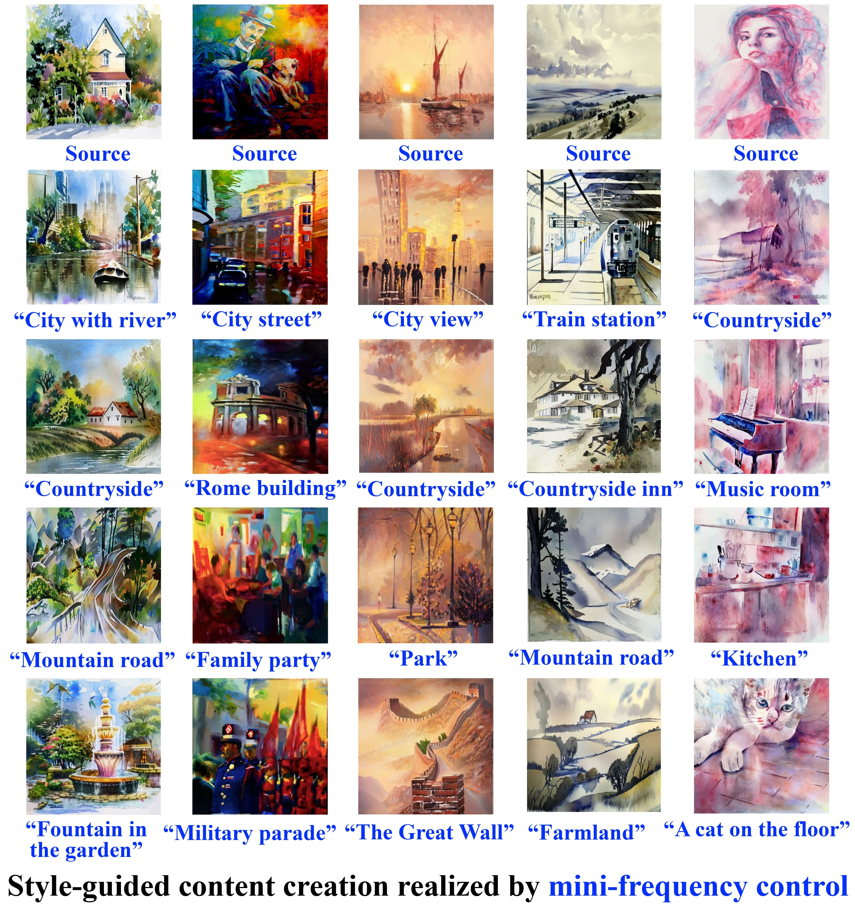

# Frequency-Controlled Diffusion Model for Versatile Text-Guided Image-to-Image Translation
This is the code of the paper "Frequency-Controlled Diffusion Model for Versatile Text-Guided Image-to-Image Translation" accepted by AAAI 2024.

# Citation #
<pre>
<code>
@inproceedings{gao2024frequency,
  title={Frequency-Controlled Diffusion Model for Versatile Text-Guided Image-to-Image Translation},
  author={Gao, Xiang and Xu, Zhengbo and Zhao, Junhan and Liu, Jiaying},
  booktitle={Proceedings of the AAAI Conference on Artificial Intelligence},
  volume={38},
  number={3},
  pages={1824--1832},
  year={2024}
}
</code>
</pre>

# Introduction
**This project tackles the problem of text-guided image-to-image translation (I2I), i.e., translating a source image with a natural-language text prompt.** We harness the immense generative power of the pre-trained large-scale text-to-image diffusion model and extend it from text-to-image generation to text-guided I2I, providing intelligent tools for image manipulation tasks.  

Observing that I2I has diverse application scenarios emphasizing different correlations (e.g., style, structure, layout, contour, etc.) between the source and translated images, it is difficult for a single existing method to suit all scenarios well. This inspires us to design a unified framework enabling flexible control over diverse I2I correlations and thus applies to diverse I2I application scenarios.  

We propose to realize versatile text-guided I2I from a novel frequency-domain perspective: model the I2I correlation of different I2I tasks with the corresponding frequency band of image features in the frequency domain. Specifically, we filter image features in the Discrete Cosine Transform (DCT) spectrum space and extract the filtered image features carrying a specific DCT frequency band as control signal to control the corresponding I2I correlation. **Accordingly, we realize I2I applications of style-guided content creation, image semantic manipulation, image scene translation, and image style translation under the mini-frequency-band control, low-frequency-band control, mid-frequency-band control, and high-frequency-band control respectively.**  

Below is the overall model architecture, please refer to the paper (coming soon) for more technical details.

                

                      
                

            
Figure 1. The overall architecture of FCDiffusion, as well as details of important modules and operations. FCDiffusion comprises the pretrained LDM, a Frequency Filtering Module (FFM), and a FreqControlNet (FCNet). The FFM applies DCT filtering to the source image features, extracting the filtered image features carrying a specific DCT frequency band as control signal, which controls the denoising process of LDM through the FCNet. FCDiffusion integrates multiple control branches with different DCT filters in the FFM, these DCT filters extract different DCT frequency bands to control different I2I correlations (e.g., image style, structure, layout, contour, etc.).
	    

	    

# Environment
First, create a new conda virtual environment:  
<pre><code>
conda create -n env_name python=3.8
</code></pre>
Then, install pytorch related packages using conda:  
<pre><code>
conda install pytorch==1.12.1 torchvision==0.13.1 torchaudio==0.12.1 cudatoolkit=11.6 -c pytorch -c conda-forge
</code></pre>
Last, install the required packages in the requirements.txt:  
<pre><code>
pip install -r requirements.txt
</code></pre>

# Dataset
Since we do not train the large-scale latent diffusion model (LDM) from scratch but rather train a frequency-based control network of the pre-trained LDM, a small subset of LAION 5B is sufficient for our task. Therefore, we use **LAION Aesthetics 6.5+** which comprises 625K image-text pairs as the training set of our model. Download and put it in the **datasets** folder of the project as shown below:

                

                      
		

Then, run the Python script **training_data_prepare.py** to create the json file of the training dataset:
<pre><code>
python training_data_prepare.py
</code></pre>
A json file **training_data.json** wil be created under the **datasets** folder. It records the image path and the text prompt of each image-text pair of the training set, and is used in the training process.

# Download the required model
Our model is based on the pretrained text-to-image latent diffusion model. Specifically, we use **Stable Diffusion v2-1-base** model in our method. Download the model checkpoint file **v2-1_512-ema-pruned.ckpt** [here](https://huggingface.co/stabilityai/stable-diffusion-2-1-base/tree/main) and put it in the **models** folder of the project. Then, run the Python script **tool_add_control_sd21.py** to create our initialized model: 
<pre><code>
python tool_add_control_sd21.py ./models/v2-1_512-ema-pruned.ckpt ./models/FCDiffusion_ini.ckpt
</code></pre>
This script will create a ckpt file of our model with the parameters initialized from the pretrained Stable Diffusion v2-1-base. The created ckpt file named **FCDiffusion_ini.ckpt** will be in the **models** folder of the project, as shown below:

                

                      
		

The training of the model will be started from the generated FCDiffusion_ini.ckpt.  

Besides, our method uses the pretrained OpenCLIP text encoder, download the **open_clip_pytorch_model.bin** file [here](https://huggingface.co/laion/CLIP-ViT-H-14-laion2B-s32B-b79K/tree/main) and put it in the **CLIP-ViT-H-14** folder of the project, as shown below:

                

                      
		

# Model training
Before training, set the **control_mode** parameter in the model_config.yaml configuration file. The parameter must be one of "**mini_pass**", "**low_pass**", "**mid_pass**", and "**high_pass**". <be>
- The "mini_pass" mode realizes style-guided content creation with mini-frequency control. 
- The "low_pass" mode realizes image semantic manipulation with low-frequency control.
- The "mid_pass" mode realizes image scene translation with mid-frequency control.
- The "high-pass" mode realizes image style translation with high-frequency control.

Then, run the Python script **fcdiffusion_train.py** to start training:
<pre><code>
python fcdiffusion_train.py
</code></pre>

# Model inference
Inference model for text-driven image-to-image translation by running the Python script **fcdiffusion_test.py**:
<pre><code>
python fcdiffusion_test.py
</code></pre>

# Results display

                

                      
                

            
Figure 2. Results of style-guided content creation realized with mini-frequency control. The image content is recreated according to the text prompt while the style of the translated image is transferred from the source image.
	    

	    
      
 

                

                      
                

            
Figure 3. Results of image semantic manipulation realized with low-frequency control. The semantics of the source image is manipulated according to the text prompt while the image style and spatial structure are maintained.
	    

	    
      
 

                

                      
                

            
Figure 4. Results of image style translation realized with high-frequency control. The image style (appearance) is modified as per the text prompt while the main contours of the source image are preserved.
	    

	    
      
 

                

                      
                

            
Figure 5. Results of image scene translation realized with mid-frequency control. The image scene is translated according to the text prompt. In this scenario, the layout of the source image is preserved while the lower-frequency image style and higher-frequency image contours are not restricted.
	    

	    
      

