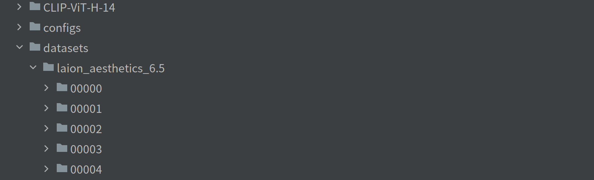

Since we do not train the large-scale latent diffusion model (LDM) from scratch but rather train a frequency-based control network of the pre-trained LDM, a small subset of LAION 5B is sufficient for our task. Therefore, we use **LAION Aesthetics 6.5+** which comprises 625K image-text pairs as the training set of our model. Download and put it in the **datasets** folder of the project as shown below:

                

                      
		

Then, run the python script **training_data_prepare.py** to create the json file of the training dataset:
<pre><code>
python training_data_prepare.py
</code></pre>
A json file **training_data.json** wil be created under the **datasets** folder. It records the image path and the text prompt of each image-text pair of the training set, and is used in the training process.
